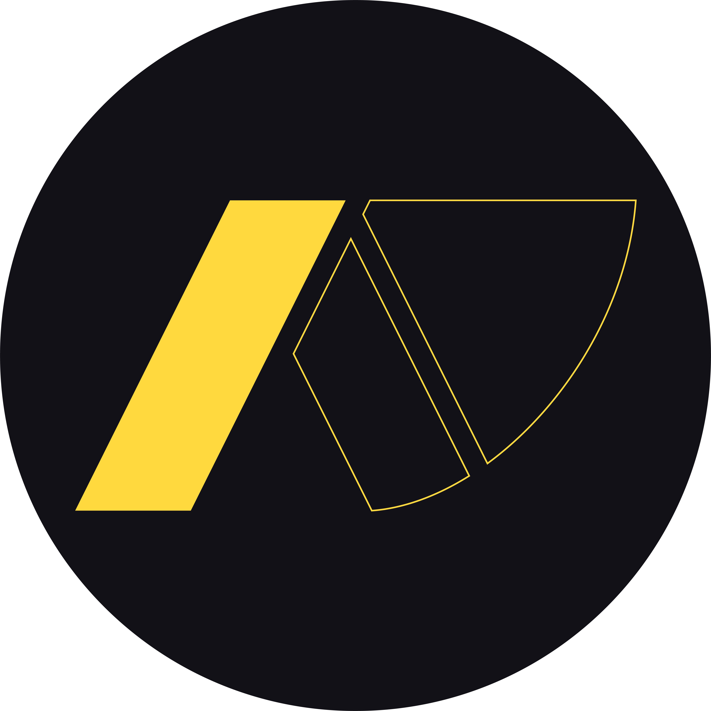

  
  <h1>Anydown</h1>
  
A lightning-fast, native Android video & audio downloader powered by yt-dlp and FFmpeg.

---

## ⚡ Features
* **Auto-Fetch:** Instantly detects YouTube links from your clipboard.
* **Smart Formats:** Choose between Best Quality (Video + Audio), Audio Only (M4A), or Fast Download (720p).
* **Native Performance:** Bypasses sluggish web wrappers by running Python and FFmpeg directly on your device via Chaquopy.
* **Background Downloads:** Thread-safe, asynchronous downloading with a live UI progress bar.
* **Brutalist UI:** A high-contrast, dark Neo-Brutalist interface built natively in Jetpack Compose.

## 📥 Download
You can download the latest version of Anydown directly from the [Releases Tab](../../releases).

## 🤝 Credits & Team
* **Lead Developer:** BOOM 
* **UI & Logo Design:** xcaventure 
* **Backend Architecture & Debugging:** Gemini & Claude
